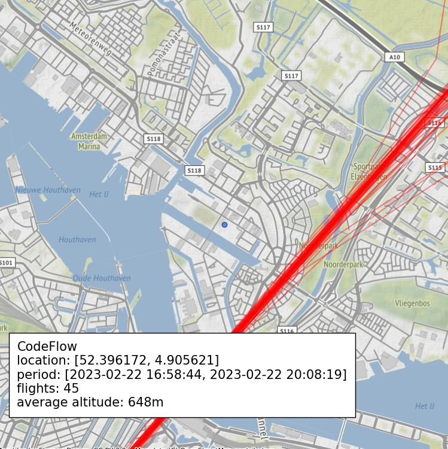

# Air Traffic Disturbance Logger & Plotter v1.0

This project aims to automatically log air traffic disturbance in your area. It uses the [opensky network](https://opensky-network.org/) to track air traffic around certain geographic bounds. 

Air traffic data is stored using MongoDB. See the [planelogger script](ovm/planelogger.py). See the [planelogger section](#loggerpy) for CLI instructions. 
Disturbance checking and plotting is done using the [disturbance finder script](ovm/disturbancefinder.py). See [Disturbance Check](#disturbancecheckpy) for CLI instructions.

Also, this project contains a Flask app that combines logging and plotting and serves the air traffic data using a REST API. See [Setup Flask App](#setup-flask-app) for instructions.

This project was developed, deployed and tested on Ubuntu 22.04 and Python 3.10

The following README assumes you're somewhat comfortable setting up Python virtual environments and that MongoDB is installed.
See [MongoDB Installation](https://www.mongodb.com/docs/manual/installation/)

## logger.py
Logs air traffic within certain geographic bounds and writes entries into a MongoDB database

Uses the OpenSky rest API (https://openskynetwork.github.io/opensky-api/rest.html)

Make sure to setup your environment correctly using MongoDB and OpenSky credentials in the ```environment.json```

Example usage:

```
# Query from opensky and store all air traffic within given certain geographic bounds every 22 seconds forever
python3 logger.py --bbox 49.44 54.16 2.82 7.02 --interval 22.0
```

All CLI arguments:

```
usage: logger.py [-h] [-b BBOX BBOX BBOX BBOX] [-l LOGLEVEL] [-p | --plot | --no-plot] [-o OUTPUTFILENAME]
                 [-z ZOOMLEVEL] [-i INTERVAL] [-r RUNS]

options:
  -h, --help            show this help message and exit
  -b BBOX BBOX BBOX BBOX, --bbox BBOX BBOX BBOX BBOX
                        Bounding Box [lat_min, lat_max, lon_min, lon_max]
  -l LOGLEVEL, --loglevel LOGLEVEL
                        LOG Level (DEBUG, INFO, WARNING, ERROR, CRITICAL)
  -p, --plot, --no-plot
                        Creates a plot for each run
  -o OUTPUTFILENAME, --outputfilename OUTPUTFILENAME
                        Plot base output filename, run number and png extension gets appended
  -z ZOOMLEVEL, --zoomlevel ZOOMLEVEL
  -i INTERVAL, --interval INTERVAL
                        Time between runs
  -r RUNS, --runs RUNS  Amount of runs between intervals, default = 0 meaning infinite
```

## disturbancecheck.py

disturbancecheck is a script that runs once, it gets all the registered complainers with their parameters and checks if any periods of disturbances have  occured within a certain timespan on their geographic location and disturbance parameters.

If a disturbance is registered, it tries to create a trajectory of all callsigns that have been found flying over complainants area. It then produces an output image like this

In the future, disturbance period information could automatically be sent to organizations responsible for collection aircraft noise complaints



All CLI arguments:

```
usage: disturbancecheck.py [-h] [-l LOGLEVEL] [-p | --plot | --no-plot] [-z ZOOMLEVEL]

options:
  -h, --help            show this help message and exit
  -l LOGLEVEL, --loglevel LOGLEVEL
                        LOG Level (DEBUG, INFO, WARNING, ERROR, CRITICAL)
  -p, --plot, --no-plot
                        Creates a plot for each run
  -z ZOOMLEVEL, --zoomlevel ZOOMLEVEL
                        Zoom level of contextly maps
```

## environment.json

The ```environment.json``` in the repository root directory contains configuration needed for both logger and disturbancecheck to run. It contains the following:
* OpenSKY credentials
* MongoDB configuration

# Setup Flask App

All files necessary for Flask to run the server-side application are contained in the ```flaskr``` directory. The Flask app does the following.

* Serves a rest API call around ```find_flights``` in ```disturbancefinder.py```
* Serves a rest API call around ```find_disturbances``` in ```disturbancefinder.py```
* Documentation is done using swagger
* Optionally, serves a user-friendly test HTML page around ```find_flights``` and ```find_disturbances```

To run the flask app. 

* Clone this repository
* CD to root directory of the cloned repository
* Setup a virtual environment ```virtualenv venv```
* Activate your virtual environment ```source venv/bin/activate```
* Install requirements ```pip install -r requirements.txt```
* You can now fire up the flask app from the CLI using the following command, replace ```<HOST-PORT>``` and ```<HOST-IP>``` with desired port and ip
  * ```flask --app flaskr/app:create_app run -p <HOST-PORT> --host=<HOST-IP>```

## App Configuration

All configuration and environment variables around the running Flask app reside in ```flaskr/environment.py```

### Pro6pp
The following properties are necessary for looking up lat, lon coordinates using pro6pp. This means you can only lookup postal codes and streetnumbers from The Netherlands if you have a pro6pp account. If you tend to use the App outside of the Netherlands, you cannot use postal codes or streetnumbers in your query

For information about pro6pp see -> https://www.pro6pp.nl/
```
PRO6PP_AUTH_KEY = '<AUTH-KEY>'
PRO6PP_API_AUTO_COMPLETE_URL = 'https://api.pro6pp.nl/v2/autocomplete/nl'
PRO6PP_API_AUTO_LOCATOR_URL = 'https://api.pro6pp.nl/v2/locator/nl'
```

### Threading
The following properties determine how many queries will be handled concurrently. ```MAX_SIZE_JOB_QUEUE``` will mean that query will immediately return with an error code if the amount of jobs waiting in the queue will exceed this number. Set to zero to disable this. Also, see ```flaskr/utils/jobqueue.py``` for implementation.
```
MAX_WORKERS = 8
MAX_SIZE_JOB_QUEUE = 1000
```

### latitude longitude address cache
To keep calls to pro6pp to a minimum, queried latitude and longitude will be stored in the MongoDB together with a timestamp. If timestamp is older then designated days, a new query will be made to update the latitude longitude coordinates
```
LATLON_CACHE_EXPIRATION_DAYS = 180
```

### States retention days
Once a day, a background job will check and delete states older than these amount of days in the database.
```
STATES_RETENTION_DAYS = 31
```

### Planelogger
The following properties determine how the planelogger will operate. These properties replace the CLI args as described in [logger.py](##logger.py)
```
LOG_INTERVAL_SECONDS = 22
PLANELOGGER_ENABLE = True
PLANELOGGER_BBOX = (49.44, 54.16, 2.82, 7.02)
```

### Test API
The following property determines if ```apitests/find_flights``` and ```apitests/find_disturbances``` will be deployed.
```
DEPLOY_TEST_API = True
```
### loglevel
Sets loglevel of app and background jobs
```
LOGLEVEL='INFO'
```

## Testing

With the running Flask application. Navigate to ```http://127.0.0.1/apidocs``` on your development machine to read the documentation generated by Swagger and test the API calls.
Optionally, if the ```DEPLOY_TEST_API = True``` navigate to ```http://127.0.0.1/apitests/find_flights``` or ```http://127.0.0.1/apitests/find_disturbances```